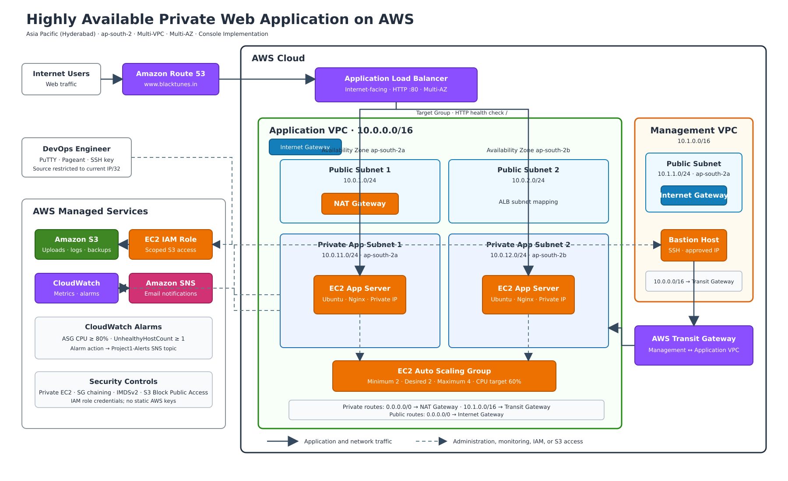

# Highly Available Private Web Application on AWS

## Project Overview

This project demonstrates the deployment of a secure, highly available, and scalable web application on AWS.

The application runs on EC2 instances inside private subnets across two Availability Zones. An internet-facing Application Load Balancer distributes incoming traffic, while an Auto Scaling Group maintains availability and adjusts capacity.

Administrative access is provided through a Bastion Host in a separate Management VPC connected through AWS Transit Gateway. Application instances access the internet through a NAT Gateway and access a private S3 bucket through an IAM role.

The application was successfully accessed using:

```text
http://www.blacktunes.in
```

> All chargeable resources were deleted after testing and validation.

---

## Architecture



### Traffic flow

```text
Internet User
    ↓
Route 53
    ↓
Application Load Balancer
    ↓
Target Group
    ↓
Auto Scaling EC2 Instances
    ↓
Private S3 Bucket
```

### Administrative access flow

```text
Administrator
    ↓
Bastion Host
    ↓
Management VPC
    ↓
Transit Gateway
    ↓
Application VPC
    ↓
Private EC2 Instance
```

---

## AWS Services Used

| AWS service               | Purpose                                                             |
| ------------------------- | ------------------------------------------------------------------- |
| Amazon VPC                | Provides isolated networks for management and application resources |
| Public Subnets            | Host the load balancer, NAT Gateway, and Bastion Host               |
| Private Subnets           | Host application EC2 instances without public IP addresses          |
| Internet Gateway          | Provides internet connectivity to public subnets                    |
| NAT Gateway               | Provides outbound internet access to private EC2 instances          |
| Application Load Balancer | Distributes HTTP traffic across healthy application instances       |
| EC2                       | Hosts the Nginx web application                                     |
| Auto Scaling              | Maintains application availability and adjusts EC2 capacity         |
| Transit Gateway           | Connects the Management VPC and Application VPC                     |
| Bastion Host              | Provides controlled SSH access to private instances                 |
| IAM                       | Provides role-based access to CloudWatch, Systems Manager, and S3   |
| Amazon S3                 | Stores application uploads, logs, and backups                       |
| Route 53                  | Routes `www.blacktunes.in` to the load balancer                     |
| CloudWatch                | Monitors CPU utilization and unhealthy targets                      |
| Amazon SNS                | Sends email notifications when alarms enter the alarm state         |

---

## Network Design

### Application VPC

```text
VPC CIDR: 10.0.0.0/16
Region: Asia Pacific (Hyderabad) — ap-south-2
```

| Subnet               | CIDR           | Availability Zone | Purpose                       |
| -------------------- | -------------- | ----------------- | ----------------------------- |
| Public Subnet 1      | `10.0.1.0/24`  | `ap-south-2a`     | Load balancer and NAT Gateway |
| Public Subnet 2      | `10.0.2.0/24`  | `ap-south-2b`     | Load balancer                 |
| Private App Subnet 1 | `10.0.11.0/24` | `ap-south-2a`     | Application EC2 instances     |
| Private App Subnet 2 | `10.0.12.0/24` | `ap-south-2b`     | Application EC2 instances     |

### Management VPC

```text
VPC CIDR: 10.1.0.0/16
```

| Subnet                   | CIDR          | Availability Zone | Purpose      |
| ------------------------ | ------------- | ----------------- | ------------ |
| Management Public Subnet | `10.1.1.0/24` | `ap-south-2a`     | Bastion Host |

---

## Route Configuration

### Application public route table

```text
10.0.0.0/16 → Local
0.0.0.0/0   → Internet Gateway
```

### Application private route tables

```text
10.0.0.0/16 → Local
10.1.0.0/16 → Transit Gateway
0.0.0.0/0   → NAT Gateway
```

### Management public route table

```text
10.1.0.0/16 → Local
10.0.0.0/16 → Transit Gateway
0.0.0.0/0   → Internet Gateway
```

---

## Security Design

### Load Balancer Security Group

Inbound traffic:

```text
HTTP 80 from 0.0.0.0/0
```

### Application Security Group

Inbound traffic:

```text
HTTP 80 from the Load Balancer Security Group
SSH 22 from the Management VPC CIDR 10.1.0.0/16
```

The application instances do not have public IPv4 addresses and cannot be accessed directly from the internet.

### Bastion Security Group

Inbound traffic:

```text
SSH 22 from the administrator's public IP address only
```

SSH access was not opened to `0.0.0.0/0`.

### S3 Security

The S3 bucket was configured with:

* Block Public Access enabled
* ACLs disabled
* Server-side encryption enabled
* Bucket versioning enabled
* IAM role-based access
* No static AWS access keys stored on EC2

---

## Application Deployment

A Launch Template was used to define the EC2 configuration:

```text
Operating system: Ubuntu Server 24.04 LTS
Instance type: t3.micro
Web server: Nginx
Storage: 8 GiB gp3
Metadata version: IMDSv2 only
Public IPv4 address: Disabled
```

The application was installed automatically using an EC2 user-data script located at:

```text
scripts/app-user-data.sh
```

---

## Auto Scaling Configuration

```text
Minimum capacity: 2
Desired capacity: 2
Maximum capacity: 4
```

The Auto Scaling Group distributes instances across two private subnets in separate Availability Zones.

A target-tracking scaling policy monitors average CPU utilization:

```text
Target CPU utilization: 60%
Instance warm-up: 180 seconds
```

The Auto Scaling Group was integrated with the load balancer target group and configured to use Elastic Load Balancing health checks.

---

## Load Balancing

The internet-facing Application Load Balancer was deployed across two public subnets.

```text
Listener protocol: HTTP
Listener port: 80
Target port: 80
Target type: EC2 instances
```

Health-check configuration:

```text
Protocol: HTTP
Path: /
Port: Traffic port
Healthy threshold: 3
Unhealthy threshold: 3
Interval: 10 seconds
Success code: 200
```

Only healthy EC2 instances receive application traffic.

---

## IAM Role

The application EC2 instances used an IAM role with the following permissions:

```text
AmazonSSMManagedInstanceCore
CloudWatchAgentServerPolicy
Restricted access to the Project1 S3 bucket
```

The custom S3 policy allowed:

```text
s3:ListBucket
s3:GetBucketLocation
s3:GetObject
s3:PutObject
s3:DeleteObject
```

Access was restricted to the project bucket and its objects.

---

## Monitoring and Alerting

Two CloudWatch alarms were created.

### High CPU alarm

```text
Metric: CPUUtilization
Statistic: Average
Threshold: Greater than or equal to 80%
Datapoints: 2 out of 2
Action: Send notification through SNS
```

### Unhealthy target alarm

```text
Metric: UnHealthyHostCount
Statistic: Maximum
Threshold: Greater than or equal to 1
Datapoints: 2 out of 2
Action: Send notification through SNS
```

An SNS topic delivered alarm notifications to a confirmed email subscription.

---

## Testing and Validation

The following tests were completed successfully:

* Application accessed through `www.blacktunes.in`
* DNS traffic routed from Route 53 to the load balancer
* Two EC2 application instances launched automatically
* Application instances distributed across two Availability Zones
* Both targets reported healthy
* Nginx application responded through the load balancer
* Bastion Host accepted SSH only from an approved public IP
* Private EC2 instance accessed through the Bastion Host
* Transit Gateway routing between both VPCs validated
* Private instances downloaded packages through the NAT Gateway
* EC2 IAM role verified using AWS STS
* File uploaded to the private S3 bucket without static credentials
* S3 object listing validated from the private EC2 instance
* CloudWatch CPU alarm reported an OK state
* CloudWatch unhealthy-target alarm reported an OK state
* SNS email subscription confirmed
* Auto Scaling Group and target-group integration validated

---

## Issues Resolved

### Bastion SSH timeout

**Problem:** The Bastion Host could not be reached on port 22.

**Resolution:**

* Verified the current Bastion public IPv4 address
* Updated the Bastion Security Group SSH source to the current administrator IP
* Confirmed the public-subnet route to the Internet Gateway
* Validated port 22 using `Test-NetConnection`

### Private EC2 public-key error

**Problem:**

```text
Permission denied (publickey)
```

**Resolution:**

* Converted the PEM key to PPK using PuTTYgen
* Loaded the PPK key into Pageant
* Enabled agent forwarding in PuTTY
* Connected to the private EC2 instance through the Bastion Host without copying the private key to the server

### S3 AccessDenied error

**Problem:**

```text
AccessDenied when calling the ListObjectsV2 operation
```

**Root cause:** The bucket ARN in the IAM policy did not exactly match the actual S3 bucket name.

**Resolution:**

* Corrected the bucket ARN
* Added `s3:ListBucket` permission to the bucket ARN
* Added object actions to the `bucket-name/*` ARN
* Retested the upload and object-listing operations successfully

---

## Cost Considerations

The following resources can generate charges even during short practice sessions:

* NAT Gateway
* Transit Gateway
* Transit Gateway attachments
* Application Load Balancer
* EC2 instances
* Public IPv4 addresses
* Route 53 hosted zone and DNS queries
* Data transfer
* S3 storage

This learning implementation used one NAT Gateway to reduce cost.

For production workloads, a NAT Gateway should normally be deployed in each Availability Zone to remove the single-AZ outbound dependency.

---

## Cleanup

After validation, the project resources were deleted in dependency order:

1. Auto Scaling Group
2. Application Load Balancer
3. Target Group
4. Launch Template
5. Bastion Host
6. Transit Gateway attachments
7. Transit Gateway
8. NAT Gateway
9. Unused Elastic IP
10. Application and Management VPCs
11. S3 objects, versions, and bucket
12. IAM role and policies
13. CloudWatch alarms
14. SNS subscription and topic
15. Route 53 project record
16. EC2 key pair

Detailed cleanup instructions are available in:

```text
docs/08-cleanup-guide.md
```

---

## Production Improvements

The following enhancements would make the architecture more production-ready:

* Deploy one NAT Gateway per Availability Zone
* Use AWS Systems Manager Session Manager instead of a Bastion Host
* Add an ACM certificate and HTTPS listener
* Redirect HTTP traffic to HTTPS
* Add AWS WAF in front of the Application Load Balancer
* Configure VPC Flow Logs
* Send Nginx and system logs to CloudWatch Logs
* Add an S3 Gateway VPC Endpoint
* Use AWS Secrets Manager for application secrets
* Add automated backups and lifecycle policies
* Deploy the infrastructure using Terraform or CloudFormation
* Add CI/CD deployment using GitHub Actions or Jenkins
* Use a dedicated Transit Gateway attachment subnet in each Availability Zone

---

## Skills Demonstrated

* Multi-VPC network design
* Public and private subnet configuration
* Route-table management
* Secure administrative access
* Transit Gateway connectivity
* Load balancing and health checks
* EC2 Launch Templates
* Auto Scaling
* IAM role-based authorization
* Private S3 integration
* Route 53 DNS routing
* CloudWatch monitoring
* SNS alerting
* Troubleshooting AWS networking and access issues
* Cost-aware resource cleanup

---

## Disclaimer

This project was created for learning, hands-on practice, and portfolio demonstration. Resource names, CIDR ranges, scaling values, and security rules should be reviewed and adjusted before using a similar architecture in a production environment.
