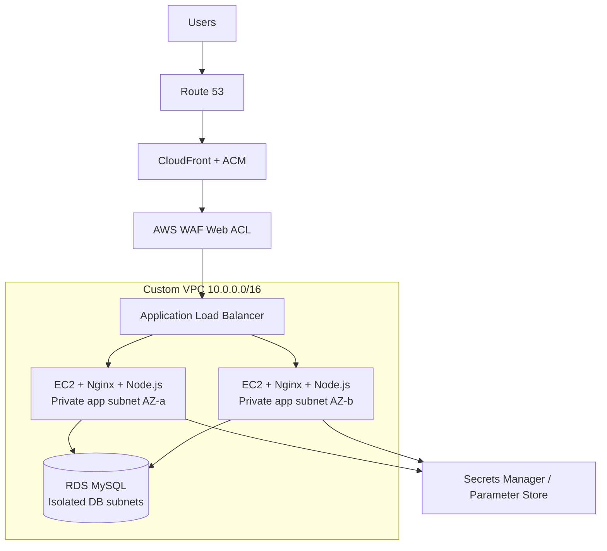
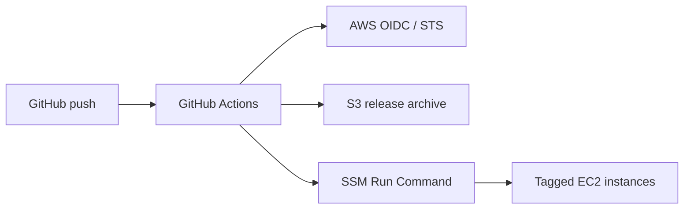

# Project 02 — Highly Available E-Commerce Application on AWS

[](https://aws.amazon.com/)
[](https://nodejs.org/)
[](https://github.com/arulkumar27/AWS-Cloud-Projects/actions/workflows/ecommerce-deploy.yml)
[](#implementation-guide)

A production-style, three-tier e-commerce workload deployed across two Availability Zones. The project demonstrates network isolation, load balancing, horizontal scaling, managed database access, secret management, health checks, and keyless CI/CD authentication.

> **Lab status:** The core deployment was built and tested successfully through the Application Load Balancer, then deleted to stop billing. This repository documents both the tested core and the complete target architecture, including Route 53, ACM, CloudFront, WAF, CloudWatch and SNS. Components not validated in the final lab are identified instead of being presented as completed evidence.

## Table of contents

- [What this project demonstrates](#what-this-project-demonstrates)
- [Architecture](#architecture)
- [Request and deployment flows](#request-and-deployment-flows)
- [AWS services](#aws-services)
- [Repository structure](#repository-structure)
- [Implementation guide](#implementation-guide)
- [CI/CD configuration](#cicd-configuration)
- [Validation](#validation)
- [Operations and troubleshooting](#operations-and-troubleshooting)
- [Security decisions](#security-decisions)
- [Availability and limitations](#availability-and-limitations)
- [Cost controls](#cost-controls)
- [Cleanup](#cleanup)
- [Lessons learned](#lessons-learned)

## What this project demonstrates

- A custom VPC with public, private application, and isolated database subnets.
- Multi-AZ placement of the ALB and EC2 Auto Scaling instances.
- Internet-facing traffic terminating at an Application Load Balancer.
- Nginx reverse proxying to a Node.js process managed by systemd.
- A private Amazon RDS for MySQL database with TLS certificate verification.
- Credentials stored in Secrets Manager and non-secret configuration in Parameter Store.
- EC2 administration and deployment through Systems Manager instead of inbound SSH.
- GitHub Actions authentication to AWS through OIDC—no long-lived AWS access keys.
- Immutable release archives uploaded to S3 and deployed with SSM Run Command.
- Application, target-group, and deployment health checks.

## Architecture


The downloadable PNG version is available at [`docs/architecture-diagram.png`](docs/architecture-diagram.png).



### Network plan

| Tier | Availability Zone A | Availability Zone B | Routing |
|---|---:|---:|---|
| Public | `10.0.1.0/24` | `10.0.2.0/24` | Internet Gateway |
| Private application | `10.0.11.0/24` | `10.0.12.0/24` | NAT Gateway per AZ |
| Isolated database | `10.0.21.0/24` | `10.0.22.0/24` | Local VPC routes only |

## Request and deployment flows

Complete application request:

```text
Client → Route 53 → CloudFront/ACM → WAF → ALB → Nginx :80 → Node.js :3000 → RDS MySQL :3306
```

Deployment:



## AWS services

| Service | Purpose |
|---|---|
| VPC | Network boundary and subnet isolation |
| Internet Gateway | Internet connectivity for public subnets |
| NAT Gateway | Controlled outbound access from private app subnets |
| EC2 | Runs Nginx and the Node.js application |
| Auto Scaling | Maintains desired capacity across two AZs |
| Application Load Balancer | Distributes HTTP traffic and performs health checks |
| RDS for MySQL | Managed relational database in isolated subnets |
| S3 | Stores versioned application release archives/assets |
| Systems Manager | Session Manager, parameters, and remote deployment commands |
| Secrets Manager | Stores database username and password |
| IAM | Least-privilege EC2 and GitHub deployment roles |
| Route 53 | Public DNS alias from the application hostname to CloudFront |
| ACM | TLS certificates for CloudFront and, if used, the regional ALB listener |
| CloudWatch | EC2, ALB, RDS, and application observability |
| SNS | Email notifications for alarms and scaling events |
| CloudFront | Global HTTPS entry point, caching and origin delivery |
| WAF | Managed protections, IP/rate rules and request visibility |

## Repository structure

```text
Project-02-Highly-Available-Ecommerce/
├── application/
│   ├── public/                 # Browser UI
│   ├── src/                    # Express app, configuration and DB code
│   ├── tests/                  # Node test runner tests
│   ├── package.json
│   └── package-lock.json
├── deployment/
│   ├── config/
│   │   ├── ecommerce.service   # systemd service
│   │   └── nginx.conf          # Reverse proxy
│   └── scripts/
│       └── ssm_deploy.sh       # Idempotent instance deployment
├── docs/
│   ├── ARCHITECTURE.md
│   ├── DEPLOYMENT.md
│   ├── EDGE-SECURITY.md
│   ├── MONITORING.md
│   ├── IAM-PERMISSIONS.md
│   ├── AWS-REFERENCES.md
│   ├── TROUBLESHOOTING.md
│   └── CLEANUP.md
├── .env.example
├── .gitignore
└── README.md
```

The workflow is stored at [`.github/workflows/ecommerce-deploy.yml`](../.github/workflows/ecommerce-deploy.yml).

## Implementation guide

The detailed console procedure is in [docs/DEPLOYMENT.md](docs/DEPLOYMENT.md). At a high level:

1. Enable an AWS Budget before provisioning.
2. Create the VPC, six subnets, route tables, IGW and NAT gateways.
3. Create ALB, application and RDS security groups.
4. Create the RDS subnet group, MySQL instance and database secret.
5. Create the private S3 release bucket and SSM parameters.
6. Create an EC2 IAM role and instance profile with SSM, S3, parameter and secret permissions.
7. Prepare one EC2 instance, install Node.js/Nginx/SSM Agent and create a golden AMI.
8. Create the target group, ALB, launch template and Auto Scaling group.
9. Configure GitHub OIDC, the deployment IAM role and repository variables.
10. Run the workflow and validate every target and endpoint.
11. Request the CloudFront ACM certificate in `us-east-1` and validate it with Route 53.
12. Create CloudFront with the ALB origin, attach WAF and point Route 53 to CloudFront.
13. Create CloudWatch alarms/dashboard and SNS notifications.
14. Validate edge, application, database, scaling and monitoring behavior.
15. Delete the lab resources when finished.

## CI/CD configuration

### GitHub repository variables

| Variable | Example | Secret? |
|---|---|---|
| `AWS_REGION` | `ap-south-1` | No |
| `AWS_ROLE_ARN` | `arn:aws:iam::<ACCOUNT_ID>:role/ecommerce-github-actions-role` | No |
| `DEPLOYMENT_BUCKET` | `ecommerce-prod-assets-<unique-suffix>` | No |

The workflow requires:

```yaml
permissions:
  contents: read
  id-token: write
```

The IAM role trust policy must restrict the GitHub issuer, audience, repository and branch. Tags do **not** control OIDC authentication. Never store AWS access keys in GitHub for this workflow.

### Runtime parameters

| Parameter | Value type |
|---|---|
| `/ecommerce/prod/db-secret-arn` | Secrets Manager ARN |
| `/ecommerce/prod/db-host` | RDS endpoint hostname |
| `/ecommerce/prod/assets-bucket` | S3 bucket name |

Database credentials stay in Secrets Manager. The deployment script writes only runtime references to `/etc/ecommerce/environment`.

## Validation

Run tests locally:

```bash
cd application
npm ci
npm test
```

After deployment:

```bash
curl -i http://<ALB-DNS-NAME>/health
curl -i http://<ALB-DNS-NAME>/api/products
```

Expected health response:

```json
{"status":"healthy","service":"ecommerce-api"}
```

Also verify:

- GitHub Actions job is green.
- Every desired EC2 instance is `Online` in Systems Manager.
- Target group shows all active targets as `healthy`.
- Auto Scaling desired/min/max values are correct.
- The storefront loads products from RDS.
- Stopping one application instance does not make the site unavailable.

## Operations and troubleshooting

Common diagnostic commands:

```bash
sudo systemctl status ecommerce.service --no-pager -l
sudo journalctl -u ecommerce.service --no-pager -n 100
sudo nginx -t
curl -i http://127.0.0.1/health
```

See [docs/TROUBLESHOOTING.md](docs/TROUBLESHOOTING.md) for the OIDC, SSM, Nginx, RDS TLS, CloudFront, WAF and target-health issues encountered during the build.

The full edge and monitoring procedures are documented in [docs/EDGE-SECURITY.md](docs/EDGE-SECURITY.md) and [docs/MONITORING.md](docs/MONITORING.md). IAM trust and permission boundaries are in [docs/IAM-PERMISSIONS.md](docs/IAM-PERMISSIONS.md).

Current service-specific guidance is linked from [docs/AWS-REFERENCES.md](docs/AWS-REFERENCES.md).

## Security decisions

- EC2 instances have no direct inbound SSH requirement.
- Application instances accept HTTP only from the ALB security group.
- RDS accepts MySQL only from the application security group.
- Database subnets have no default internet route.
- GitHub receives short-lived AWS credentials through OIDC.
- S3 public access is blocked and releases are versioned.
- RDS traffic uses the AWS global CA bundle with certificate verification.
- The systemd service runs as `ec2-user` with additional hardening options.
- Secrets, private keys, account IDs, endpoints and real ARNs must not be committed.

See [SECURITY.md](SECURITY.md) for disclosure and credential-handling guidance.

## Availability and limitations

- The ALB and application tier span two Availability Zones.
- Auto Scaling replaces unhealthy EC2 instances.
- The lab used a **Single-AZ RDS instance** because of account/free-plan constraints. That database remains a single point of failure; production should use Multi-AZ RDS.
- Two NAT gateways improve AZ independence but generate hourly and data-processing charges.
- SSM Run Command deploys to all matching instances, but it is not a complete rolling/blue-green deployment controller.
- Infrastructure was created manually in the AWS Console. Production environments should use Terraform, AWS CDK or CloudFormation for repeatability.

## Cost controls

This architecture is not guaranteed to be free-tier-only. NAT Gateway, ALB, public IPv4, RDS, Route 53, Secrets Manager, CloudWatch and data transfer can incur charges. Credits reduce the bill but do not make resources free.

- Create AWS Budgets alerts before provisioning.
- Use the smallest eligible EC2/RDS sizes for a short-lived lab.
- Delete NAT gateways early during teardown.
- Release unattached Elastic IPs and delete orphaned EBS volumes/snapshots.
- Empty versioned S3 buckets before deletion.
- Recheck Billing, Cost Explorer and Free Tier after cleanup; billing data can lag.

## Cleanup

Follow [docs/CLEANUP.md](docs/CLEANUP.md). The safe dependency order is:

```text
Disable pipeline → ASG/EC2 → ALB/target group → RDS → S3 → NAT/EIP
→ AMI/snapshot → IAM → security groups/subnets → route tables/IGW/VPC
```

Keep the Route 53 hosted zone and registered domain if they are shared with other projects.

## Lessons learned

- A green build is not a successful deployment; target health and application logs must also be checked.
- OIDC failures are usually trust-policy subject/audience mismatches, not missing tags.
- Auto Scaling instance tags should be configured to propagate at launch.
- `127.0.0.1:3306` means the application did not receive the RDS host configuration.
- TLS verification requires the RDS CA bundle inside every immutable release target.
- A default Nginx server can conflict with a second `server_name _` block.
- Teardown is part of the project: dependency-aware cleanup prevents continuing charges.

## Author

**Arul Kumar** — [GitHub](https://github.com/arulkumar27)
