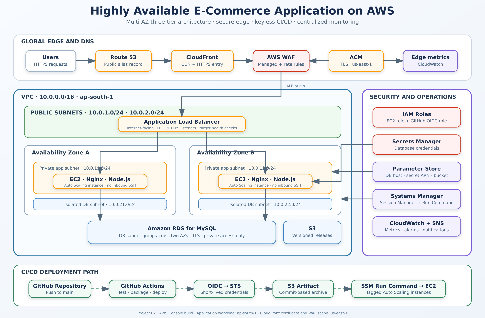

# Project 02 - Highly Available E-Commerce Application on AWS

[](https://aws.amazon.com/)
[](https://nodejs.org/)
[](https://github.com/arulkumar27/AWS-Cloud-Projects/actions/workflows/project-02-ecommerce-deploy.yml)
[](#implementation-overview)

A production-style, three-tier e-commerce application deployed on AWS across two Availability Zones.

The project demonstrates network isolation, load balancing, Auto Scaling, private database connectivity, secret management, TLS-secured database communication, health checks and keyless CI/CD deployment using GitHub Actions and AWS Systems Manager.

> **Lab status:** The core application infrastructure was built, deployed and successfully tested through the Application Load Balancer. The resources were later deleted to prevent continued AWS charges. Route 53, ACM, CloudFront, WAF, CloudWatch and SNS are included as the complete target architecture. Components that were not validated in the final lab are documented honestly rather than presented as completed evidence.

## Table of Contents

- [Project Objectives](#project-objectives)
- [Architecture](#architecture)
- [Implemented Architecture](#implemented-architecture)
- [Complete Target Architecture](#complete-target-architecture)
- [Network Design](#network-design)
- [AWS Services](#aws-services)
- [Application Request Flow](#application-request-flow)
- [CI/CD Deployment Flow](#cicd-deployment-flow)
- [Repository Structure](#repository-structure)
- [Implementation Overview](#implementation-overview)
- [GitHub Actions Configuration](#github-actions-configuration)
- [Runtime Configuration](#runtime-configuration)
- [Application Endpoints](#application-endpoints)
- [Deployment Validation](#deployment-validation)
- [Security Controls](#security-controls)
- [Monitoring](#monitoring)
- [Availability and Limitations](#availability-and-limitations)
- [Cost Considerations](#cost-considerations)
- [Troubleshooting](#troubleshooting)
- [Cleanup](#cleanup)
- [Lessons Learned](#lessons-learned)
- [Author](#author)

## Project Objectives

This project was created to demonstrate:

- A custom AWS VPC with multiple network tiers.
- Resources distributed across two Availability Zones.
- Public, private application and isolated database subnets.
- An internet-facing Application Load Balancer.
- EC2 Auto Scaling across private application subnets.
- Nginx as a reverse proxy for a Node.js application.
- Amazon RDS for MySQL in isolated database subnets.
- Database credentials stored in AWS Secrets Manager.
- Non-secret runtime values stored in Systems Manager Parameter Store.
- EC2 administration through Systems Manager instead of public SSH.
- GitHub Actions authentication using AWS OIDC.
- Deployment artifacts stored in a private, versioned S3 bucket.
- Application deployment using Systems Manager Run Command.
- CloudWatch monitoring and SNS alerting.
- Route 53, ACM, CloudFront and AWS WAF edge-security design.
- Dependency-aware AWS resource cleanup.

## Architecture



## Implemented Architecture

The core infrastructure that was built and validated used this request path:

```text
User
  ->
Application Load Balancer
  ->
Nginx on EC2 port 80
  ->
Node.js on 127.0.0.1:3000
  ->
Amazon RDS for MySQL on port 3306
```

The implemented deployment path was:

```text
GitHub
  ->
GitHub Actions
  ->
AWS OIDC and STS
  ->
Amazon S3 release artifact
  ->
AWS Systems Manager Run Command
  ->
EC2 Auto Scaling instances
```

This project does not use AWS CodeBuild, CodePipeline or CodeDeploy.

## Complete Target Architecture

The complete production-style edge design is:

```text
Users
  ->
Route 53
  ->
CloudFront with ACM certificate
  ->
AWS WAF Web ACL
  ->
Application Load Balancer
  ->
EC2 Auto Scaling instances
  ->
Amazon RDS for MySQL
```

In this design:

- Route 53 provides public DNS resolution.
- CloudFront provides the public HTTPS entry point.
- ACM provides the TLS certificate.
- AWS WAF filters malicious and excessive requests.
- The ALB distributes traffic across application instances.
- Auto Scaling maintains application capacity.
- RDS stores application data in private database subnets.

The detailed edge implementation is available in [docs/EDGE-SECURITY.md](docs/EDGE-SECURITY.md).

## Network Design

### VPC

```text
VPC name: ecommerce-prod-vpc
IPv4 CIDR: 10.0.0.0/16
AWS Region: ap-south-1
Availability Zones: ap-south-1a and ap-south-1b
```

### Subnets

| Tier | Availability Zone A | Availability Zone B |
|---|---|---|
| Public | `10.0.1.0/24` | `10.0.2.0/24` |
| Private application | `10.0.11.0/24` | `10.0.12.0/24` |
| Isolated database | `10.0.21.0/24` | `10.0.22.0/24` |

### Route Tables

Public route table:

```text
VPC local route
0.0.0.0/0 -> Internet Gateway
```

Private application route table for AZ A:

```text
VPC local route
0.0.0.0/0 -> NAT Gateway in AZ A
```

Private application route table for AZ B:

```text
VPC local route
0.0.0.0/0 -> NAT Gateway in AZ B
```

Database route table:

```text
VPC local route only
No default internet route
```

AWS automatically creates a main route table with every VPC. The main route table was not used for workload subnet associations.

### Security Groups

| Security group | Inbound source | Port |
|---|---|---:|
| ALB security group | Internet or CloudFront origin traffic | 80/443 |
| Application security group | ALB security group | 80 |
| RDS security group | Application security group | 3306 |

The EC2 application instances do not require public SSH access.

## AWS Services

| AWS service | Purpose |
|---|---|
| Amazon VPC | Network isolation |
| Public subnets | Hosts ALB and NAT gateways |
| Private application subnets | Hosts EC2 Auto Scaling instances |
| Isolated database subnets | Hosts the RDS subnet group |
| Internet Gateway | Public subnet internet connectivity |
| NAT Gateway | Outbound connectivity for private instances |
| EC2 | Runs Nginx and the Node.js application |
| Auto Scaling | Maintains application capacity |
| Application Load Balancer | Distributes requests and checks target health |
| RDS for MySQL | Managed relational database |
| S3 | Stores versioned deployment artifacts |
| Systems Manager | Session Manager, Parameter Store and Run Command |
| Secrets Manager | Stores database credentials |
| IAM | Provides EC2 and GitHub deployment roles |
| Route 53 | Public DNS |
| ACM | TLS certificates |
| CloudFront | Global HTTPS content delivery |
| AWS WAF | Managed and rate-based request filtering |
| CloudWatch | Metrics, alarms, dashboards and logs |
| SNS | Email alarm notifications |
| AWS Budgets | Cost alerts |

## Application Request Flow

```text
Client request
  ->
Route 53 resolves the application hostname
  ->
CloudFront terminates public HTTPS
  ->
AWS WAF inspects the request
  ->
Application Load Balancer selects a healthy target
  ->
Nginx receives the request on port 80
  ->
Nginx forwards the request to Node.js on 127.0.0.1:3000
  ->
Node.js retrieves credentials from Secrets Manager
  ->
Node.js connects to RDS using verified TLS
  ->
The response returns through the same request path
```

## CI/CD Deployment Flow

The actual project pipeline is:

```text
Developer pushes Project 02 changes
  ->
GitHub Actions starts
  ->
Application dependencies are installed
  ->
Automated tests run
  ->
Production dependencies are packaged
  ->
GitHub authenticates to AWS using OIDC
  ->
Release archive uploads to S3
  ->
Systems Manager sends commands to tagged EC2 instances
  ->
EC2 downloads and installs the release
  ->
systemd restarts the Node.js application
  ->
The deployment script validates /health
```

Workflow location:

```text
.github/workflows/project-02-ecommerce-deploy.yml
```

The workflow belongs to Project 02 because it contains:

```yaml
name: Deploy Project 02 Ecommerce

env:
  PROJECT_DIR: Project-02-Highly-Available-Ecommerce

on:
  push:
    paths:
      - "Project-02-Highly-Available-Ecommerce/**"
      - ".github/workflows/project-02-ecommerce-deploy.yml"
```

Changes to another project folder do not trigger this workflow.

## Repository Structure

```text
AWS-Cloud-Projects/
|
|-- .github/
|   `-- workflows/
|       `-- project-02-ecommerce-deploy.yml
|
`-- Project-02-Highly-Available-Ecommerce/
    |
    |-- application/
    |   |-- public/
    |   |   |-- index.html
    |   |   |-- app.js
    |   |   `-- styles.css
    |   |
    |   |-- src/
    |   |   |-- app.js
    |   |   |-- config.js
    |   |   |-- db.js
    |   |   `-- server.js
    |   |
    |   |-- tests/
    |   |   `-- health.test.js
    |   |
    |   |-- package.json
    |   `-- package-lock.json
    |
    |-- deployment/
    |   |-- config/
    |   |   |-- ecommerce.service
    |   |   `-- nginx.conf
    |   |
    |   `-- scripts/
    |       `-- ssm_deploy.sh
    |
    |-- docs/
    |   |-- architecture-diagram.png
    |   |-- ARCHITECTURE.md
    |   |-- AWS-REFERENCES.md
    |   |-- CLEANUP.md
    |   |-- DEPLOYMENT.md
    |   |-- EDGE-SECURITY.md
    |   |-- IAM-PERMISSIONS.md
    |   |-- MONITORING.md
    |   `-- TROUBLESHOOTING.md
    |
    |-- .env.example
    |-- .gitignore
    |-- README.md
    `-- SECURITY.md
```

## Implementation Overview

The detailed AWS Console guide is available in [docs/DEPLOYMENT.md](docs/DEPLOYMENT.md).

High-level implementation:

1. Create an AWS Budget and billing alert.
2. Create the custom VPC.
3. Create six subnets across two Availability Zones.
4. Create and attach the Internet Gateway.
5. Create NAT gateways and Elastic IP addresses.
6. Configure public, private application and database route tables.
7. Create ALB, application and database security groups.
8. Create the RDS subnet group.
9. Create the private MySQL RDS database.
10. Store database credentials in Secrets Manager.
11. Create the private, encrypted and versioned S3 bucket.
12. Create Systems Manager Parameter Store values.
13. Create the EC2 IAM role and instance profile.
14. Prepare the EC2 golden image.
15. Create the target group and Application Load Balancer.
16. Create the EC2 launch template.
17. Create the Auto Scaling group across private subnets.
18. Configure GitHub OIDC.
19. Create the GitHub Actions deployment role.
20. Configure GitHub repository variables.
21. Run the GitHub Actions deployment.
22. Validate the application and target health.
23. Configure Route 53, ACM, CloudFront and WAF for the complete edge design.
24. Configure CloudWatch alarms and SNS notifications.
25. Delete lab resources after completing validation.

## GitHub Actions Configuration

### Required permissions

```yaml
permissions:
  contents: read
  id-token: write
```

### Repository variables

| Variable | Example |
|---|---|
| `AWS_REGION` | `ap-south-1` |
| `AWS_ROLE_ARN` | `arn:aws:iam::<ACCOUNT_ID>:role/ecommerce-github-actions-role` |
| `DEPLOYMENT_BUCKET` | `ecommerce-prod-assets-<UNIQUE_SUFFIX>` |

These are configuration values and not database passwords.

Do not store permanent AWS access keys in GitHub.

### EC2 deployment tags

The workflow sends SSM commands to instances containing both tags:

```text
Project=ecommerce-prod
Environment=production
```

Configure Auto Scaling to propagate these tags to every new instance.

## Runtime Configuration

The deployment script reads:

```text
/ecommerce/prod/db-secret-arn
/ecommerce/prod/db-host
/ecommerce/prod/assets-bucket
```

Environment file created on EC2:

```text
/etc/ecommerce/environment
```

Example values:

```text
NODE_ENV=production
PORT=3000
AWS_REGION=ap-south-1
DB_NAME=ecommerce
DB_HOST=<RDS_ENDPOINT>
DB_CA_PATH=/etc/ecommerce/global-bundle.pem
DB_SECRET_ARN=<SECRET_ARN>
ASSETS_BUCKET=<S3_BUCKET>
```

Database username and password are retrieved from Secrets Manager at runtime.

They are not committed to GitHub.

## Application Endpoints

### Liveness endpoint

```text
GET /health
```

Expected response:

```json
{
  "status": "healthy",
  "service": "ecommerce-api"
}
```

This endpoint confirms that the Node.js application process is running.

### Readiness endpoint

```text
GET /ready
```

This endpoint checks the database connection.

Successful response:

```json
{
  "status": "ready",
  "database": "connected"
}
```

### Products endpoint

```text
GET /api/products
```

This endpoint retrieves products from Amazon RDS.

## Deployment Validation

Run tests locally:

```bash
cd Project-02-Highly-Available-Ecommerce/application
npm ci
npm test
```

After deployment, test the ALB:

```bash
curl -i http://<ALB-DNS-NAME>/health
curl -i http://<ALB-DNS-NAME>/ready
curl -i http://<ALB-DNS-NAME>/api/products
```

For the complete edge design:

```bash
curl -I https://<APPLICATION-HOSTNAME>/
curl -i https://<APPLICATION-HOSTNAME>/health
curl -i https://<APPLICATION-HOSTNAME>/api/products
```

Also confirm:

- GitHub Actions workflow completes successfully.
- EC2 instances appear as Online in Systems Manager.
- All expected target-group instances are healthy.
- Auto Scaling desired and in-service capacities match.
- The application loads products from RDS.
- RDS is not publicly accessible.
- S3 Block Public Access is enabled.
- SNS notifications are confirmed.
- CloudWatch metrics and alarms are visible.

## Security Controls

Security controls implemented or documented include:

- No permanent AWS keys in GitHub.
- GitHub OIDC with temporary STS credentials.
- EC2 application instances in private subnets.
- No public SSH requirement.
- Session Manager for administrative access.
- RDS in isolated database subnets.
- Security-group-to-security-group rules.
- Database credentials in Secrets Manager.
- Non-secret configuration in Parameter Store.
- Private and versioned S3 bucket.
- RDS TLS certificate verification.
- systemd service hardening.
- CloudFront HTTPS.
- AWS WAF managed and rate-based rules.
- CloudWatch monitoring and SNS alerting.

See [SECURITY.md](SECURITY.md) for the complete security policy.

See [docs/IAM-PERMISSIONS.md](docs/IAM-PERMISSIONS.md) for IAM responsibilities.

## Monitoring

Recommended monitoring includes:

- ALB healthy and unhealthy host count.
- ALB target 5XX responses.
- ALB target response time.
- EC2 CPU utilization.
- Auto Scaling desired and in-service capacity.
- RDS CPU utilization.
- RDS database connections.
- RDS free storage.
- CloudFront 4XX and 5XX error rates.
- WAF allowed, counted and blocked requests.
- SNS email notifications.

See [docs/MONITORING.md](docs/MONITORING.md).

## Availability and Limitations

### Availability features

- ALB deployed across two Availability Zones.
- Application instances distributed across two private subnets.
- Auto Scaling replaces unhealthy EC2 instances.
- Target-group health checks remove unhealthy targets.
- Separate NAT Gateway routes improve Availability Zone independence.

### Lab limitations

- The lab used Single-AZ RDS because of account and free-plan restrictions.
- Single-AZ RDS remains a database single point of failure.
- Production should use Multi-AZ RDS.
- SSM Run Command deploys to matching instances but is not a complete blue/green deployment system.
- Infrastructure was created manually through the AWS Console.
- Production environments should use Terraform, AWS CDK or CloudFormation.
- The application currently creates and seeds its database table during startup.
- Production applications should use a database migration tool.
- Automated tests currently cover only the liveness endpoint.
- Additional readiness, API, database and error-handling tests should be added.
- Content Security Policy is currently disabled in the application and should be configured for production.
- CloudFront, WAF and the complete edge path were documented as the target design but were not part of the final validated core deployment.

## Cost Considerations

This architecture is not guaranteed to remain within the AWS Free Tier.

The following services can generate charges:

- NAT Gateway
- Application Load Balancer
- Public IPv4 addresses
- EC2
- RDS
- S3
- Secrets Manager
- Route 53
- CloudFront
- AWS WAF
- CloudWatch
- Data transfer

AWS credits reduce the bill but do not make resources free.

Cost-control actions:

- Create AWS Budget alerts before provisioning.
- Use the smallest account-eligible EC2 and RDS sizes.
- Keep lab environments active only when needed.
- Delete NAT gateways early during cleanup.
- Release unused Elastic IP addresses.
- Delete unattached EBS volumes.
- Delete unused snapshots and AMIs.
- Empty versioned S3 buckets before deletion.
- Review Billing and Cost Explorer after cleanup.
- Remember that billing information can take time to update.

## Troubleshooting

Useful EC2 commands:

```bash
sudo systemctl status ecommerce.service --no-pager -l
sudo journalctl -u ecommerce.service --no-pager -n 100
sudo nginx -t
curl -i http://127.0.0.1/health
curl -i http://127.0.0.1/ready
curl -i http://127.0.0.1/api/products
```

Common issues documented include:

- GitHub OIDC trust-policy errors.
- SSM commands remaining Pending or InProgress.
- Missing systemd service.
- Database connections falling back to `127.0.0.1:3306`.
- RDS certificate-chain errors.
- Conflicting Nginx default-server configuration.
- Unhealthy and draining ALB targets.
- CloudFront origin errors.
- Incorrect CloudFront API caching.
- AWS WAF false-positive blocks.
- Route 53 and ACM configuration problems.

See [docs/TROUBLESHOOTING.md](docs/TROUBLESHOOTING.md).

## Cleanup

Follow the dependency-aware guide in [docs/CLEANUP.md](docs/CLEANUP.md).

Recommended order:

```text
Disable GitHub Actions deployment
  ->
Set Auto Scaling capacity to zero
  ->
Delete Auto Scaling and EC2 resources
  ->
Delete ALB and target group
  ->
Delete RDS and database configuration
  ->
Empty and delete S3
  ->
Delete CloudFront, WAF and project DNS records
  ->
Delete NAT gateways and release Elastic IPs
  ->
Delete AMI and snapshot
  ->
Delete CloudWatch and SNS resources
  ->
Delete IAM roles
  ->
Delete security groups and subnets
  ->
Delete route tables and Internet Gateway
  ->
Delete the VPC
```

Do not delete a shared Route 53 hosted zone or registered domain.

## Lessons Learned

- A successful build does not guarantee a healthy deployment.
- Application logs and target health must be checked after deployment.
- GitHub OIDC failures are normally caused by audience or subject mismatches.
- Resource tags do not fix OIDC trust-policy failures.
- Auto Scaling tags must propagate to new instances.
- SSM requires online managed instances and outbound AWS API connectivity.
- A missing database hostname can cause connections to fall back to localhost.
- RDS certificate verification requires the AWS RDS CA bundle.
- Multiple Nginx default-server configurations can conflict.
- Dynamic API responses require careful CloudFront cache policies.
- WAF rules should be evaluated in Count mode before Block mode.
- Edge services must not be presented as tested when only the core ALB path was validated.
- AWS cleanup is part of the project lifecycle.

## Documentation

- [Architecture Decisions](docs/ARCHITECTURE.md)
- [AWS Console Deployment](docs/DEPLOYMENT.md)
- [Route 53, ACM, CloudFront and WAF](docs/EDGE-SECURITY.md)
- [IAM Roles and Permissions](docs/IAM-PERMISSIONS.md)
- [CloudWatch and SNS Monitoring](docs/MONITORING.md)
- [Troubleshooting Runbook](docs/TROUBLESHOOTING.md)
- [Cleanup Checklist](docs/CLEANUP.md)
- [Official References](docs/AWS-REFERENCES.md)
- [Security Policy](SECURITY.md)
- [GitHub Actions Workflow](../.github/workflows/project-02-ecommerce-deploy.yml)

## Author

**Arul Kumar**

- GitHub: [arulkumar27](https://github.com/arulkumar27)
- Repository: [AWS-Cloud-Projects](https://github.com/arulkumar27/AWS-Cloud-Projects)
