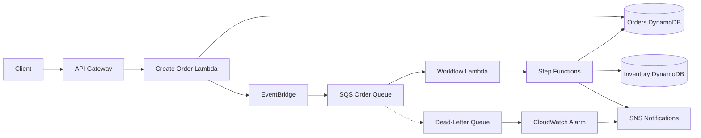
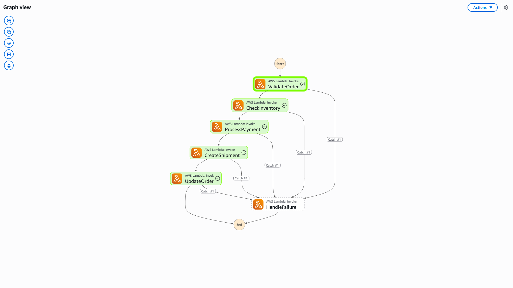
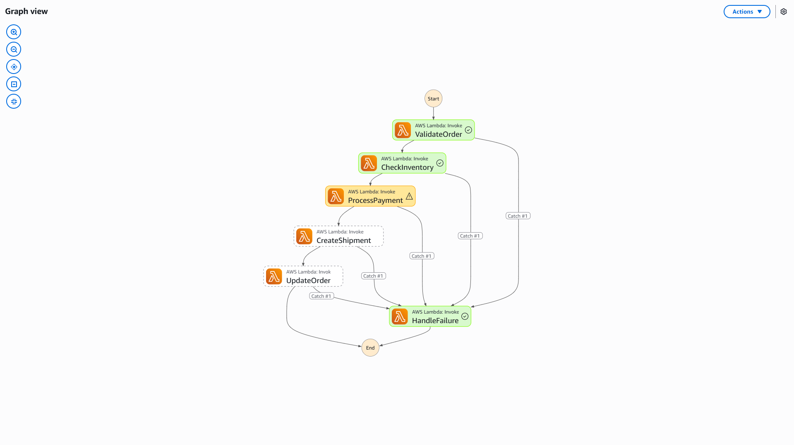
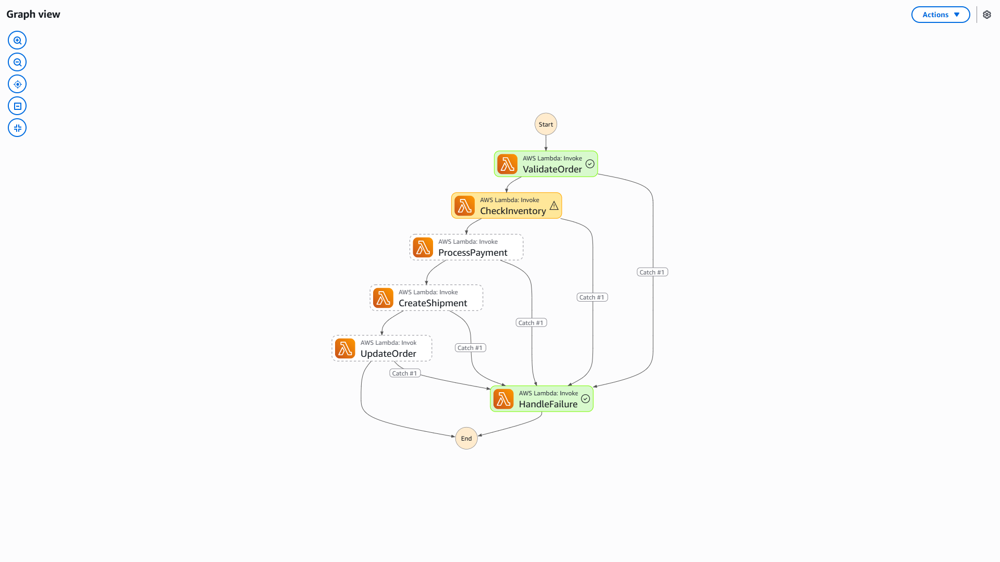
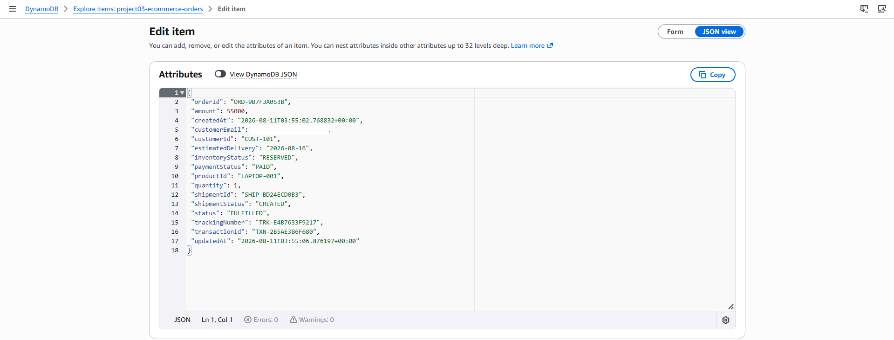
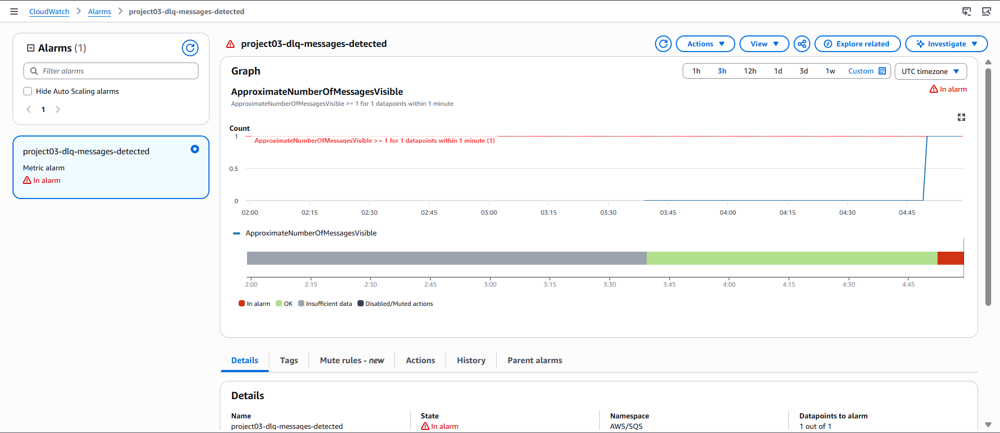

# Project 03: Event-Driven E-Commerce Order Fulfilment

A production-style serverless backend that processes e-commerce orders asynchronously using AWS event-driven services.

The system validates orders, reserves inventory, simulates payment, creates shipments, handles failures, and sends operational alerts. The complete infrastructure is deployed using AWS SAM and CloudFormation.

## Architecture



## Order Workflow

```text
Validate Order
→ Reserve Inventory
→ Process Payment
→ Create Shipment
→ Update Order
→ Send Notification
```

Successful order lifecycle:

```text
ORDER_RECEIVED → VALIDATED → INVENTORY_RESERVED
→ PAYMENT_COMPLETED → SHIPMENT_CREATED → FULFILLED
```

## AWS Services

| Service | Purpose |
|---|---|
| API Gateway | Public order API |
| Lambda | Serverless business logic |
| DynamoDB | Order and inventory storage |
| EventBridge | Order event routing |
| SQS | Reliable asynchronous processing |
| Step Functions | Workflow orchestration |
| SNS | Success and failure notifications |
| DLQ | Failed message preservation |
| CloudWatch | Logs, metrics and alarms |
| IAM | Least-privilege access |
| SAM/CloudFormation | Infrastructure as Code |

## Production Features

- Event-driven and loosely coupled architecture
- Asynchronous order processing
- Atomic DynamoDB inventory reservation
- Idempotent Step Functions executions
- Partial SQS batch failure handling
- Automatic retries with exponential backoff
- Payment-failure inventory rollback
- Dead-letter queue for failed messages
- CloudWatch DLQ alarm
- Structured Lambda logs
- Seven-day log retention
- Least-privilege IAM permissions

## Failure Handling

### Payment Failure

When payment fails after inventory reservation, the system releases the reserved stock and cancels the order.

```text
Inventory Reserved → Payment Failed
→ Inventory Released → Order Cancelled
```

### Inventory Failure

When stock is unavailable, payment and shipment processing are skipped.

```text
Validation Successful → Inventory Unavailable
→ Order Cancelled
```

### Technical Failure

Messages that fail three processing attempts are moved to the DLQ. CloudWatch detects the message and triggers an SNS alert.

## Project Structure

```text
├── template.yaml
├── src/
│   ├── create-order/
│   ├── start-workflow/
│   ├── validate-order/
│   ├── check-inventory/
│   ├── process-payment/
│   ├── create-shipment/
│   ├── update-order/
│   └── failure-handler/
├── statemachine/
├── events/
├── scripts/
└── docs/
```

## Deployment

```powershell
sam validate --lint
sam build
sam deploy --guided
python scripts\seed-inventory.py
```

Deployment region:

```text
ap-south-1 — Mumbai
```

## Testing

```powershell
.\scripts\send-test-order.ps1 -Scenario success
.\scripts\send-test-order.ps1 -Scenario payment-failure
.\scripts\send-test-order.ps1 -Scenario inventory-failure
```

## Implementation Evidence

### Successful Order Fulfilment



### Payment Failure Handling



### Inventory Failure Handling



### Fulfilled DynamoDB Order



### CloudWatch DLQ Alarm



## Key Outcome

This project demonstrates how AWS managed services can process orders reliably without continuously running servers. It covers event routing, queue-based decoupling, workflow orchestration, data consistency, failure recovery, and operational monitoring.

## Skills Demonstrated

`AWS` `Serverless` `Event-Driven Architecture` `Python` `SAM` `CloudFormation` `Lambda` `API Gateway` `DynamoDB` `EventBridge` `SQS` `Step Functions` `SNS` `CloudWatch` `IAM`