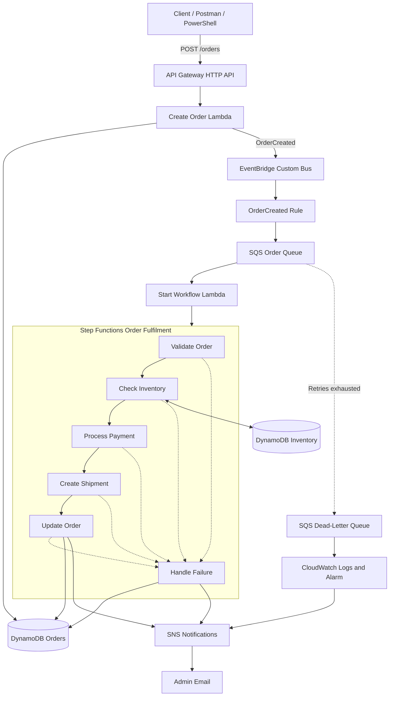

# Architecture

## Successful order flow

1. Client submits an order through API Gateway.
2. Create Order Lambda validates the request and stores the initial order.
3. An `OrderCreated` event is published to EventBridge.
4. EventBridge routes the event to the SQS order queue.
5. Start Workflow Lambda consumes the message and starts Step Functions.
6. Step Functions validates the order, reserves inventory, processes payment and creates a shipment.
7. Final details are stored in DynamoDB.
8. SNS sends a fulfilment notification.

## Failure handling

- Invalid orders are routed to the failure handler.
- Insufficient inventory cancels processing before payment.
- Payment failure releases previously reserved inventory.
- SQS retries technical failures.
- Messages exceeding the retry limit move to the DLQ.
- CloudWatch detects DLQ messages and triggers an SNS alert.